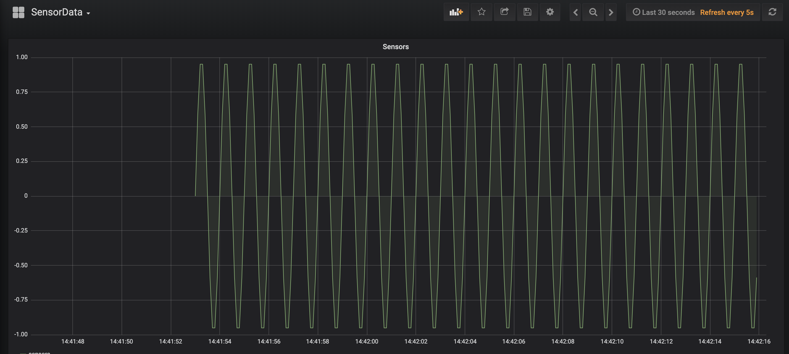
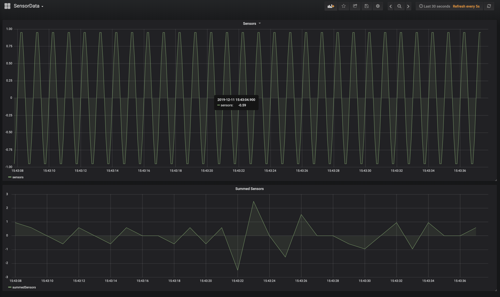
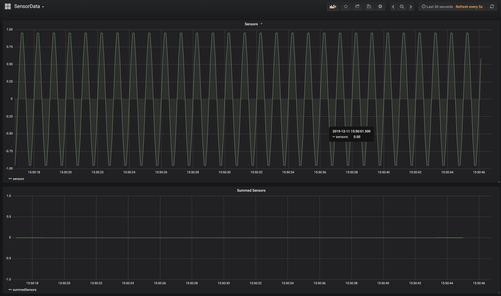
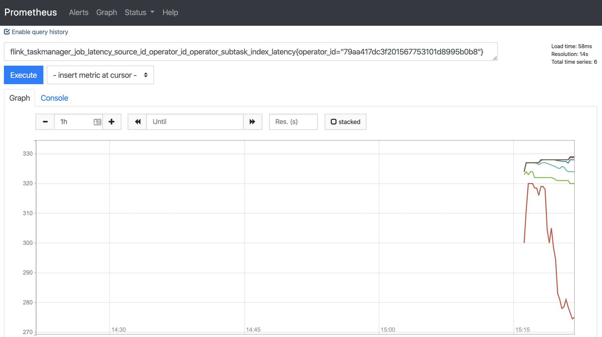
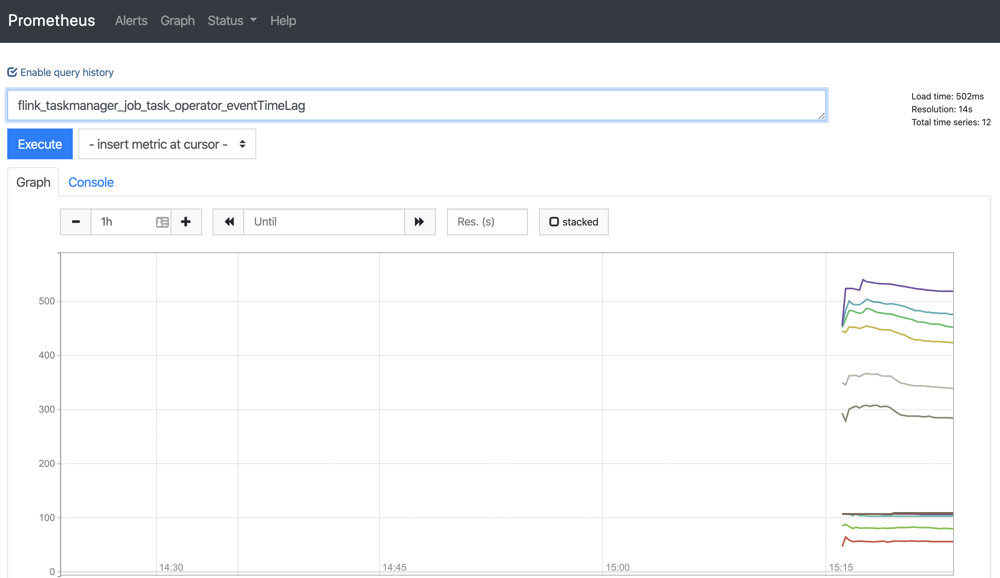

# ReadMe

This application is a playground for various explorations with Apache Flink.

# Setup

For most of the services that are needed, you can use docker:

```cd docker && docker-compose up -d```

This will start influxdb, grafana, and prometheus. 
It will take about one minute until the data source and dashboard are added to Grafana.

Grafana is served on `localhost:3000`. Login as admin/admin.

The Prometheus UI is served on `localhost:9090`.

You can run this app in an IDE, which will supply the necessary pieces of Flink. There's no need
to run a separate Flink cluster.

To shut things down, use

```cd docker && docker-compose down```

## Note for linux users

The prometheus configuration works out of the box for Mac and Windows, but on Linux you will need to 
edit `docker/prometheus/prometheus.yml` before starting docker, and change both instances of 
`host.docker.internal` to `172.17.0.1`.

# Explorations

## Event Time vs. Processing Time

The `TimingExplorer` Flink application includes a custom source that generates 10 events per second for
a simulated pressure sensor. These events are sent to an InfluxDB sink that is connected to Grafana.
If you wait for the Grafana dashboard to become available, and start the `TimingExplorer`
job, you will see something like this:



This application adds up the events in one-second-long windows, and displays this sum in the dashboard:



This lower graph of the windowed results would be perfectly flat if each one-second-long window contained 
exactly the 10 events generated each second. However, because the windowing is being done with processing 
time semantics, each window contains however many events happen to be available, whether that's 8, or 11, or
whatever, which leads to the non-deterministic results shown above.

If you rerun the application with `eventTime` set to true, then it will produce deterministic results:



## Measuring Latency

This job has latency tracking enabled, so you can observe the latency tracking metrics. The docker setup
includes an instance of prometheus at `localhost:9090` that you can use to inspect these metrics. Look at
`flink_taskmanager_job_latency_source_id_operator_id_operator_subtask_index_latency` to see these values.
To drill in on one operator, try something like `flink_taskmanager_job_latency_source_id_operator_id_operator_subtask_index_latency{operator_id="79aa417dc3f201567753101d8995b0b8"}`



Also, the `InfluxDBSink` used by this application has a custom histogram metric called _eventTimeLag_ 
that measures the distribution of latencies from source to sink. You can query 
`flink_taskmanager_job_task_operator_eventTimeLag` in the prometheus UI to see these values.



### Affecting latency

You can try making a change to the job that should make latency significantly worse, and see 
how that shows up in these measurements.

## State Backends

This project includes an example of how to switch from one state backend to another using the
State Processor API.

`ChangeBackend` is another Flink application that is included in this project. 
This application uses the State Processor API to read a savepoint made by running the 
`TimingExplorer` app with a heap-based state backend, and it can then write
out a new savepoint that uses the RocksDB state backend. Since the `TimingExplorer` uses operator state,
keyed state, and timers, `ChangeBackend` is a fairly complete example of how to work with the State Processor API.

To verify that the new savepoint works correctly, you can run `TimingExplorer` 
with `useRocksDB` set to true. and restart the application from the new RocksDB-based savepoint.

# Disclaimer
Apache®, Apache Flink™, Flink™, and the Apache feather logo are trademarks of [The Apache Software Foundation](http://apache.org).
